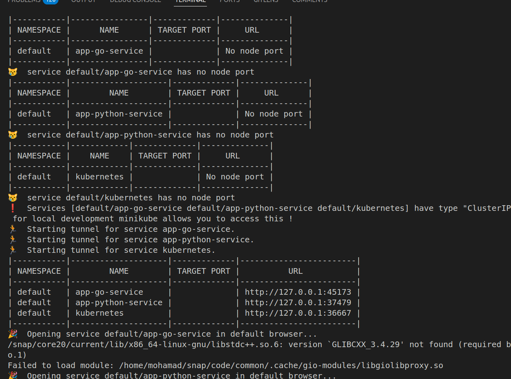
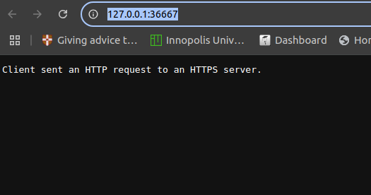
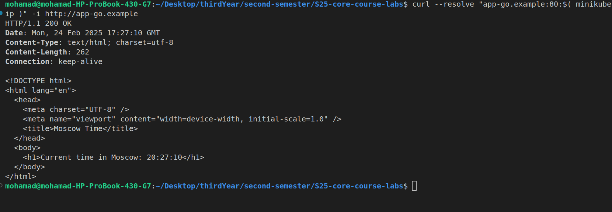
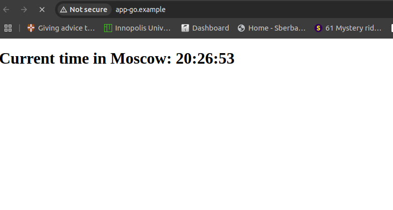

<!-- task1:

1.Learn About Kubernetes
2.Install Kubernetes tools on my machine
3. deploy Your Application:
`kubectl create deployment app-python --image=oshaheen1882051/app_python:app_python-prod-1.0.0`

list deployments


minikube service app-python --url
http://192.168.49.2:30873


kubectl get pods,svc
NAME                              READY   STATUS    RESTARTS       AGE
pod/app-python-56b7bc77c7-tfvsv   1/1     Running   1 (137m ago)   17h

NAME                 TYPE        CLUSTER-IP      EXTERNAL-IP   PORT(S)          AGE
service/app-python   NodePort    10.103.46.145   <none>        5000:30873/TCP   19m
service/kubernetes   ClusterIP   10.96.0.1       <none>        443/TCP          17h


task2:

after creating `dpeloyment.yml` and apply :


kubectl get pods,svc
NAME                            READY   STATUS    RESTARTS   AGE
pod/app-python-b4bcf684-8sr56   1/1     Running   0          45m
pod/app-python-b4bcf684-j7jgq   1/1     Running   0          45m
pod/app-python-b4bcf684-vfx4w   1/1     Running   0          45m

NAME                         TYPE        CLUSTER-IP     EXTERNAL-IP   PORT(S)    AGE
service/app-python-service   ClusterIP   10.108.55.82   <none>        5000/TCP   6m30s
service/kubernetes           ClusterIP   10.96.0.1      <none>        443/TCP    25h


minikube service --all
inikube service --all
|-----------|--------------------|-------------|--------------|
| NAMESPACE |        NAME        | TARGET PORT |     URL      |
|-----------|--------------------|-------------|--------------|
| default   | app-python-service |             | No node port |
|-----------|--------------------|-------------|--------------|
😿  service default/app-python-service has no node port
|-----------|------------|-------------|--------------|
| NAMESPACE |    NAME    | TARGET PORT |     URL      |
|-----------|------------|-------------|--------------|
| default   | kubernetes |             | No node port |
|-----------|------------|-------------|--------------|
😿  service default/kubernetes has no node port
❗  Services [default/app-python-service default/kubernetes] have type "ClusterIP" not meant to be exposed, however for local development minikube allows you to access this !
🏃  Starting tunnel for service app-python-service.
🏃  Starting tunnel for service kubernetes.
|-----------|--------------------|-------------|------------------------|
| NAMESPACE |        NAME        | TARGET PORT |          URL           |
|-----------|--------------------|-------------|------------------------|
| default   | app-python-service |             | http://127.0.0.1:36721 |
| default   | kubernetes         |             | http://127.0.0.1:41371 |
|-----------|--------------------|-------------|------------------------|
🎉  Opening service default/app-python-service in default browser...
/snap/core20/current/lib/x86_64-linux-gnu/libstdc++.so.6: version `GLIBCXX_3.4.29' not found (required by /lib/x86_64-linux-gnu/libproxy.so.1)
Failed to load module: /home/mohamad/snap/code/common/.cache/gio-modules/libgiolibproxy.so
🎉  Opening service default/kubernetes in default browser...
/snap/core20/current/lib/x86_64-linux-gnu/libstdc++.so.6: version `GLIBCXX_3.4.29' not found (required by /lib/x86_64-linux-gnu/libproxy.so.1)
Failed to load module: /home/mohamad/snap/code/common/.cache/gio-modules/libgiolibproxy.so
❗  Because you are using a Docker driver on linux, the terminal needs to be open to run it.
Opening in existing browser session.
Opening in existing browser session.


first link:


second link:


bouns:
after creating go-deployment.yml and apply and go-service.yml and apply it:


kubectl get pods,svc
NAME                            READY   STATUS    RESTARTS   AGE
pod/app-go-85cfd4657d-5bx7k     1/1     Running   0          69s
pod/app-go-85cfd4657d-7bcr8     1/1     Running   0          70s
pod/app-go-85cfd4657d-b69kv     1/1     Running   0          71s
pod/app-python-b4bcf684-8sr56   1/1     Running   0          63m
pod/app-python-b4bcf684-j7jgq   1/1     Running   0          63m
pod/app-python-b4bcf684-vfx4w   1/1     Running   0          63m

NAME                         TYPE        CLUSTER-IP      EXTERNAL-IP   PORT(S)    AGE
service/app-go-service       ClusterIP   10.111.53.222   <none>        3000/TCP   6m10s
service/app-python-service   ClusterIP   10.108.55.82    <none>        5000/TCP   24m
service/kubernetes           ClusterIP   10.96.0.1       <none>        443/TCP    25h


minikube service --all

-----------|----------------|-------------|--------------|
| NAMESPACE |      NAME      | TARGET PORT |     URL      |
|-----------|----------------|-------------|--------------|
| default   | app-go-service |             | No node port |
|-----------|----------------|-------------|--------------|
😿  service default/app-go-service has no node port
|-----------|--------------------|-------------|--------------|
| NAMESPACE |        NAME        | TARGET PORT |     URL      |
|-----------|--------------------|-------------|--------------|
| default   | app-python-service |             | No node port |
|-----------|--------------------|-------------|--------------|
😿  service default/app-python-service has no node port
|-----------|------------|-------------|--------------|
| NAMESPACE |    NAME    | TARGET PORT |     URL      |
|-----------|------------|-------------|--------------|
| default   | kubernetes |             | No node port |
|-----------|------------|-------------|--------------|
😿  service default/kubernetes has no node port
❗  Services [default/app-go-service default/app-python-service default/kubernetes] have type "ClusterIP" not meant to be exposed, however for local development minikube allows you to access this !
🏃  Starting tunnel for service app-go-service.
🏃  Starting tunnel for service app-python-service.
🏃  Starting tunnel for service kubernetes.
|-----------|--------------------|-------------|------------------------|
| NAMESPACE |        NAME        | TARGET PORT |          URL           |
|-----------|--------------------|-------------|------------------------|
| default   | app-go-service     |             | http://127.0.0.1:45173 |
| default   | app-python-service |             | http://127.0.0.1:37479 |
| default   | kubernetes         |             | http://127.0.0.1:36667 |
|-----------|--------------------|-------------|------------------------|
🎉  Opening service default/app-go-service in default browser...
/snap/core20/current/lib/x86_64-linux-gnu/libstdc++.so.6: version `GLIBCXX_3.4.29' not found (required by /lib/x86_64-linux-gnu/libproxy.so.1)
Failed to load module: /home/mohamad/snap/code/common/.cache/gio-modules/libgiolibproxy.so
🎉  Opening service default/app-python-service in default browser...
/snap/core20/current/lib/x86_64-linux-gnu/libstdc++.so.6: version `GLIBCXX_3.4.29' not found (required by /lib/x86_64-linux-gnu/libproxy.so.1)
Failed to load module: /home/mohamad/snap/code/common/.cache/gio-modules/libgiolibproxy.so
🎉  Opening service default/kubernetes in default browser...
/snap/core20/current/lib/x86_64-linux-gnu/libstdc++.so.6: version `GLIBCXX_3.4.29' not found (required by /lib/x86_64-linux-gnu/libproxy.so.1)
Failed to load module: /home/mohamad/snap/code/common/.cache/gio-modules/libgiolibproxy.so
❗  Because you are using a Docker driver on linux, the terminal needs to be open to run it.
Opening in existing browser session.
Opening in existing browser session.
Opening in existing browser session.


ingress curl:

curl --resolve "app-python.example:80:$( minikube ip )" -i http://app-python.example
HTTP/1.1 200 OK
Date: Mon, 24 Feb 2025 16:27:37 GMT
Content-Type: text/html; charset=utf-8
Content-Length: 261
Connection: keep-alive

<!DOCTYPE html>
<html lang="en">
  <head>
    <meta charset="UTF-8" />
    <meta name="viewport" content="width=device-width, initial-scale=1.0" />
    <title>Moscow Time</title>
  </head>
  <body>
    <h1>Current time in Moscow: 19:27:37</h1>
  </body>


ingress curl for go 

 curl --resolve "app-go.example:80:$( minikube ip )" -i http://app-go.example
HTTP/1.1 200 OK
Date: Mon, 24 Feb 2025 17:27:10 GMT
Content-Type: text/html; charset=utf-8
Content-Length: 262
Connection: keep-alive

<!DOCTYPE html>
<html lang="en">
  <head>
    <meta charset="UTF-8" />
    <meta name="viewport" content="width=device-width, initial-scale=1.0" />
    <title>Moscow Time</title>
  </head>
  <body>
    <h1>Current time in Moscow: 20:27:10</h1>
  </body>
</html>


 -->

# Lab 9: Introduction to Kubernetes

This lab focuses on setting up a local Kubernetes environment using Minikube, deploying applications, and creating Kubernetes manifests. Below are the tasks completed, along with evidence and outputs.

---

## Task 1: Kubernetes Setup and Basic Deployment

### 1. Learn About Kubernetes

Studied the fundamentals of Kubernetes, including its components and architecture. Referenced the official Kubernetes documentation:

- [What is Kubernetes?](https://kubernetes.io/docs/concepts/overview/what-is-kubernetes/)
- [Kubernetes Components](https://kubernetes.io/docs/concepts/overview/components/)

### 2. Install Kubernetes Tools

Installed `kubectl` and `minikube` to manage the Kubernetes cluster locally. Followed the official guide:

- [Kubernetes Tools Installation](https://kubernetes.io/docs/tasks/tools/)

### 3. Deploy Your Application

Deployed a Python application using the following command:

```bash
kubectl create deployment app-python --image=oshaheen1882051/app_python:app_python-prod-1.0.0
```

**Screenshot of Deployment Creation:**


**List of Deployments:**


### 4. Access Your Application

Exposed the application using a Service and retrieved its URL:

```bash
minikube service app-python --url
```

**Output:**

```out
http://192.168.49.2:30873
```

**Screenshot of Service URL:**


### 5. Verify Deployment and Service

Checked the status of Pods and Services:

```bash
kubectl get pods,svc
```

**Output:**

```out
NAME                              READY   STATUS    RESTARTS       AGE
pod/app-python-56b7bc77c7-tfvsv   1/1     Running   1 (137m ago)   17h

NAME                 TYPE        CLUSTER-IP      EXTERNAL-IP   PORT(S)          AGE
service/app-python   NodePort    10.103.46.145   <none>        5000:30873/TCP   19m
service/kubernetes   ClusterIP   10.96.0.1       <none>        443/TCP          17h
```

**Screenshots:**


### 6. Cleanup

Removed the Deployment and Service to maintain a clean environment:

```bash
kubectl delete deployment app-python
kubectl delete service app-python
```


---

## Task 2: Declarative Kubernetes Manifests

### 1. Create Deployment Manifest

Created a `deployment.yml` file to deploy the Python application with 3 replicas. Applied the manifest:

```bash
kubectl apply -f deployment.yml
```

**Screenshot of Deployment Application:**


### 2. Create Service Manifest

Created a `service.yml` file to expose the application. Applied the manifest:

```bash
kubectl apply -f service.yml
```

### 3. Verify Deployment and Service

Checked the status of Pods and Services:

```bash
kubectl get pods,svc
```

**Output:**

```out
NAME                            READY   STATUS    RESTARTS   AGE
pod/app-python-b4bcf684-8sr56   1/1     Running   0          45m
pod/app-python-b4bcf684-j7jgq   1/1     Running   0          45m
pod/app-python-b4bcf684-vfx4w   1/1     Running   0          45m

NAME                         TYPE        CLUSTER-IP     EXTERNAL-IP   PORT(S)    AGE
service/app-python-service   ClusterIP   10.108.55.82   <none>        5000/TCP   6m30s
service/kubernetes           ClusterIP   10.96.0.1      <none>        443/TCP    25h
```

**Screenshot:**


### 4. Access Services via Minikube

Retrieved the URLs for all services:

```bash
minikube service --all
```

**Output:**

```out
|-----------|--------------------|-------------|--------------|
| NAMESPACE |        NAME        | TARGET PORT |     URL      |
|-----------|--------------------|-------------|--------------|
| default   | app-python-service |             | No node port |
|-----------|--------------------|-------------|--------------|
😿  service default/app-python-service has no node port
|-----------|------------|-------------|--------------|
| NAMESPACE |    NAME    | TARGET PORT |     URL      |
|-----------|------------|-------------|--------------|
| default   | kubernetes |             | No node port |
|-----------|------------|-------------|--------------|
😿  service default/kubernetes has no node port
❗  Services [default/app-python-service default/kubernetes] have type "ClusterIP" not meant to be exposed, however for local development minikube allows you to access this !
🏃  Starting tunnel for service app-python-service.
🏃  Starting tunnel for service kubernetes.
|-----------|--------------------|-------------|------------------------|
| NAMESPACE |        NAME        | TARGET PORT |          URL           |
|-----------|--------------------|-------------|------------------------|
| default   | app-python-service |             | http://127.0.0.1:36721 |
| default   | kubernetes         |             | http://127.0.0.1:41371 |
|-----------|--------------------|-------------|------------------------|
🎉  Opening service default/app-python-service in default browser...
/snap/core20/current/lib/x86_64-linux-gnu/libstdc++.so.6: version `GLIBCXX_3.4.29' not found (required by /lib/x86_64-linux-gnu/libproxy.so.1)
Failed to load module: /home/mohamad/snap/code/common/.cache/gio-modules/libgiolibproxy.so
🎉  Opening service default/kubernetes in default browser...
/snap/core20/current/lib/x86_64-linux-gnu/libstdc++.so.6: version `GLIBCXX_3.4.29' not found (required by /lib/x86_64-linux-gnu/libproxy.so.1)
Failed to load module: /home/mohamad/snap/code/common/.cache/gio-modules/libgiolibproxy.so
❗  Because you are using a Docker driver on linux, the terminal needs to be open to run it.
Opening in existing browser session.
Opening in existing browser session.
```

**Screenshots:**


---

## Bonus Task: Additional Configuration and Ingress

### 1. Deploy Additional Application

Created `go-deployment.yml` and `go-service.yml` manifests for a Go application. Applied the manifests:

```bash
kubectl apply -f go-deployment.yml
kubectl apply -f go-service.yml
```

**Screenshots:**


### 2. Verify Deployment and Service

Checked the status of Pods and Services:

```bash
kubectl get pods,svc
```

**Output:**

```out
NAME                            READY   STATUS    RESTARTS   AGE
pod/app-go-85cfd4657d-5bx7k     1/1     Running   0          69s
pod/app-go-85cfd4657d-7bcr8     1/1     Running   0          70s
pod/app-go-85cfd4657d-b69kv     1/1     Running   0          71s
pod/app-python-b4bcf684-8sr56   1/1     Running   0          63m
pod/app-python-b4bcf684-j7jgq   1/1     Running   0          63m
pod/app-python-b4bcf684-vfx4w   1/1     Running   0          63m

NAME                         TYPE        CLUSTER-IP      EXTERNAL-IP   PORT(S)    AGE
service/app-go-service       ClusterIP   10.111.53.222   <none>        3000/TCP   6m10s
service/app-python-service   ClusterIP   10.108.55.82    <none>        5000/TCP   24m
service/kubernetes           ClusterIP   10.96.0.1       <none>        443/TCP    25h
```

**Screenshot:**


### 3. Access Services via Minikube

Retrieved the URLs for all services:

```bash
minikube service --all
```

**Output:**

```out

-----------|----------------|-------------|--------------|
| NAMESPACE |      NAME      | TARGET PORT |     URL      |
|-----------|----------------|-------------|--------------|
| default   | app-go-service |             | No node port |
|-----------|----------------|-------------|--------------|
😿  service default/app-go-service has no node port
|-----------|--------------------|-------------|--------------|
| NAMESPACE |        NAME        | TARGET PORT |     URL      |
|-----------|--------------------|-------------|--------------|
| default   | app-python-service |             | No node port |
|-----------|--------------------|-------------|--------------|
😿  service default/app-python-service has no node port
|-----------|------------|-------------|--------------|
| NAMESPACE |    NAME    | TARGET PORT |     URL      |
|-----------|------------|-------------|--------------|
| default   | kubernetes |             | No node port |
|-----------|------------|-------------|--------------|
😿  service default/kubernetes has no node port
❗  Services [default/app-go-service default/app-python-service default/kubernetes] have type "ClusterIP" not meant to be exposed, however for local development minikube allows you to access this !
🏃  Starting tunnel for service app-go-service.
🏃  Starting tunnel for service app-python-service.
🏃  Starting tunnel for service kubernetes.
|-----------|--------------------|-------------|------------------------|
| NAMESPACE |        NAME        | TARGET PORT |          URL           |
|-----------|--------------------|-------------|------------------------|
| default   | app-go-service     |             | http://127.0.0.1:45173 |
| default   | app-python-service |             | http://127.0.0.1:37479 |
| default   | kubernetes         |             | http://127.0.0.1:36667 |
|-----------|--------------------|-------------|------------------------|
🎉  Opening service default/app-go-service in default browser...
/snap/core20/current/lib/x86_64-linux-gnu/libstdc++.so.6: version `GLIBCXX_3.4.29' not found (required by /lib/x86_64-linux-gnu/libproxy.so.1)
Failed to load module: /home/mohamad/snap/code/common/.cache/gio-modules/libgiolibproxy.so
🎉  Opening service default/app-python-service in default browser...
/snap/core20/current/lib/x86_64-linux-gnu/libstdc++.so.6: version `GLIBCXX_3.4.29' not found (required by /lib/x86_64-linux-gnu/libproxy.so.1)
Failed to load module: /home/mohamad/snap/code/common/.cache/gio-modules/libgiolibproxy.so
🎉  Opening service default/kubernetes in default browser...
/snap/core20/current/lib/x86_64-linux-gnu/libstdc++.so.6: version `GLIBCXX_3.4.29' not found (required by /lib/x86_64-linux-gnu/libproxy.so.1)
Failed to load module: /home/mohamad/snap/code/common/.cache/gio-modules/libgiolibproxy.so
❗  Because you are using a Docker driver on linux, the terminal needs to be open to run it.
Opening in existing browser session.
Opening in existing browser session.
Opening in existing browser session.
```

**Screenshots:**




### 4. Test Ingress with Curl

Verified application availability using `curl`:

```bash
curl --resolve "app-python.example:80:$( minikube ip )" -i http://app-python.example
curl --resolve "app-go.example:80:$( minikube ip )" -i http://app-go.example
```

**Outputs:**

- **Python Application:**

  ```out
  HTTP/1.1 200 OK
  <!DOCTYPE html>
  <html lang="en">
    <h1>Current time in Moscow: 19:27:37</h1>
  ```

  

- **Go Application:**

  ```out
  HTTP/1.1 200 OK
  <!DOCTYPE html>
  <html lang="en">
    <h1>Current time in Moscow: 20:27:10</h1>
  ```

  
  
